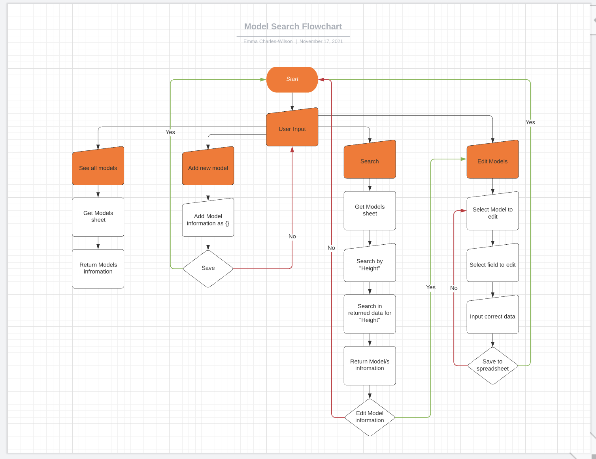
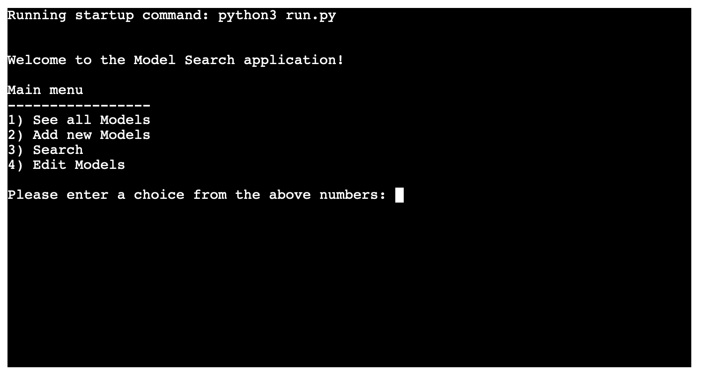

# Model Search

[Live application can be found here]()

This is a command-line-interface application designed for a user to access models, retrieve models by a certain catagory, edit/delete existing models & add new models. This project has been designed for educational purposes and uses the Code Institutes mock terminal to run.

---
## UX
To begin planning this project I started first with UX, designing the logic of the programme based upon the user stories. As this is a command-line application there is no design featured as HTML & CSS have not been used. 

### Strategy
User Stories:
- As a user, I want to be able to easily access all of my models at once.
- As a user, I want to be able to retrieve a model's information based upon their first or last name.
- As a user, I want to add new model information.
- As a user, I want to update an existing model's information if there has been a change.
- As a user, I want to be able to retrieve a model's information based upon age. 
- As a user, I want to be able to retrieve a model's information based upon height.
- As a user, I want to be able to retrieve a model's information based upon hair colour.
- As a user, I want to be able to retrieve a model's information based upon gender.
- As a user, I want to be able to delete a model.

### Structure

As you can see from the flowchart above the logic has been based around the four key user options, retrieving all models, adding models & editing existing models, and searching for models by specific catagory. Each path will take the user back to the beginning once finished.

---
## Features
The features included in this programme are listed in the main menu and they can be seen below:

### Retrieve all models:
- From the main menu there is an option to Retrieve All Models, once the user has selected this all of the models will be printed to the terminal.

### Search Models:
- From the main menu there is an option to Search Models, once the user has selected this they are taken to another menu where they can choose what they would like to search by. 
    - First name
    - Last name
    - Height
    - Hair Colour 
    - Age 
    - Gender 
- Once the user has selected the field to search by & input the name/height/hair colour/age/gender, if there is a match this will be printed to the terminal.

### Add new models:
- From the main menu there is an option to Add New Model.
- Once the user has selected this option they are then asked to input a value for First Name, Last Name, Height, Hair Colour, Age, Gender. 
- Once all fields have been entered the model is saved.
- The models details are printed to the terminal and the user is asked if they want to edit the information.
- If they do they will be taken to edit the contact, otherwise they can go back to the main menu.

### Edit existing models:
- From the main menu there is an option to Edit Existing Models, once the user has selected this they will first be taken to search for the model they would like to edit.
- After the model has been found they will have the option to edit by typing Y/N
- If they select Y they will then be able to choose which field of the model they would like to edit. 
- They input the new information and save it.
- The worksheet is updated with the new models information.