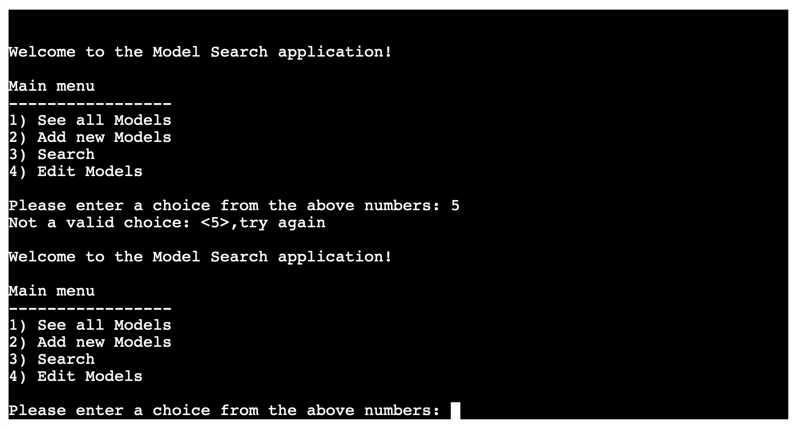

# Model Search

[Live application can be found here]()

This is a command-line-interface application designed for a user to access models, retrieve models by a certain catagory, edit/delete existing models & add new models. This project has been designed for educational purposes and uses the Code Institutes mock terminal to run.

---
## UX
To begin planning this project I started first with UX, designing the logic of the programme based upon the user stories. As this is a command-line application there is no design featured as HTML & CSS have not been used. 

### Strategy
User Stories:
- As a user, I want to be able to easily access all of my models at once.
- As a user, I want to be able to retrieve a model's information based upon their first name, last name, height, hair colour, age or gender.
- As a user, I want to add new model information.
- As a user, I want to update an existing model's information if there has been a change.
- As a user, I want to be able to delete a model.

### Structure

As you can see from the flowchart above the logic has been based around the four key user options, retrieving all models, adding models & editing existing models, and searching for models by specific catagory. Each path will take the user back to the beginning once finished.

---
## Features
The features included in this programme are listed in the main menu and they can be seen below:

### Retrieve all models:
- From the main menu there is an option to Retrieve All Models, once the user has selected this all of the models will be printed to the terminal.

### Search Models:
- From the main menu there is an option to Search Models, once the user has selected this they are taken to another menu where they can choose what they would like to search by. 
    - First name
    - Last name
    - Height
    - Hair Colour 
    - Age 
    - Gender 
- Once the user has selected the field to search by & input the name/height/hair colour/age/gender, if there is a match this will be printed to the terminal.

### Add new models:
- From the main menu there is an option to Add New Model.
- Once the user has selected this option they are then asked to input a value for First Name, Last Name, Height, Hair Colour, Age, Gender. 
- Once all fields have been entered the user will be asked if they would like to save the model or not. 
- If they do the model will be saved, otherwise they can go back to the main menu.

### Edit existing models:
- From the main menu there is an option to Edit Existing Models, once the user has selected this they will first be taken to search for the model by first name or last name.
- The user will then be asked for the name they would like to search. 
- If theres a match found, this will be printed to the terminal and the user will be asked to select which model they would like to edit. 
- The user will be asked which field they would like to edit and then be asked for the new information. 
- The new information will be saved to the spreadsheet. 

---
## Technologies Used

I have used several technologies that have enabled this design to work:

- [Python](https://www.python.org/)
    - Python is the core programming language used to write all of the code in this application to make it fully functional.
    - In addition to core Python I have used the following Python modules:
        - [Gspread](https://docs.gspread.org/en/latest/)
            - Used to access my google sheets document throughout the application, to access and edit data.
        - [Google Auth](https://google-auth.readthedocs.io/en/master/)
            - Used to provide access to the application to interact with my google sheet.
        - [pyinputplus](https://pyinputplus.readthedocs.io/en/latest/)
            - Used to validate all of the user inputs.
        - [PDB](https://www.geeksforgeeks.org/debugging-python-code-using-breakpoint-and-pdb/)
            - Used to debug my code when facing issues.
- [GitHub](https://github.com/)
    - Used to store code for the project after being pushed.
- [Git](https://git-scm.com/)
    - Used for version control by utilising the Gitpod terminal to commit to Git and Push to GitHub.
- [Gitpod](https://www.gitpod.io/)
    - Used as the development environment.
- [Heroku](https://dashboard.heroku.com/apps)
    - Used to deploy my application.
- [Lucid](https://lucid.app/documents#/dashboard)
    - Used to create the flowchart for the project.
- [Grammarly](https://www.grammarly.com/)
    - Used to fix the thousands of grammar errors across the project.
- [Google Sheets](https://www.google.co.uk/sheets/about/)
    - Used to store the 'Contacts' data used for the application.
- [Pep8](http://pep8online.com/)
    - Used to test my code for any issues or errors.

---
## Testing

### User Stories

*'As a user, I want to be able to easily access all of my models at once.'*  
This is one of the choices from the main menu, if the user selects option 1 all of the model's are printed to the terminal.

*'As a user, I want to be able to retrieve a model's information based upon their first name, last name, height, hair colour, age or gender.'*  
This is one of the choices from the main menu, if the user selects option 2, they are taken to search their models by either name/height/hair colour/age/gender. If there is a match found it is printed to the terminal. 

*'As a user, I want to add new model information.'*  
This is one of the choices from the main menu, if the user selects option 3, they are taken to add a new contact. The user is asked to input a value for First Name, Last Name, Height, Hair Colour, Age, Gender. 

*'As a user, I want to update an existing model's information if there has been a change.'*  
This is one of the choices from the main menu, if the user selects option 4, they are taken to search their contacts by either first name or last name. If there is a match found it is printed to the terminal and the user gets the option to edit a specific field. 

*'As a user, I want to be able to delete a contact entry.'*  
After searching for a contact the user will be given the option to delete it, if they choose this option the contact is deleted from the worksheet.

### Input Validation

As this programme relies heavily on users inputting information, validating these values is of the utmost importance at every step to ensure the information is viable.
I chose to use the `pyinputplus` module as this offers built in validation. The main use of this is when the users are presented with a numbered menu, they then must input their choice, I used the following function:  
`def user_response(message, min_value, max_value):    
    input = pyip.inputInt(prompt=message, min=min_value, max=max_value)  
    return input`   

I added the minimum and maximum value parameters to ensure that the user is only able to enter the numbers present in the menu, if they do not then the following error message is displayed:  

