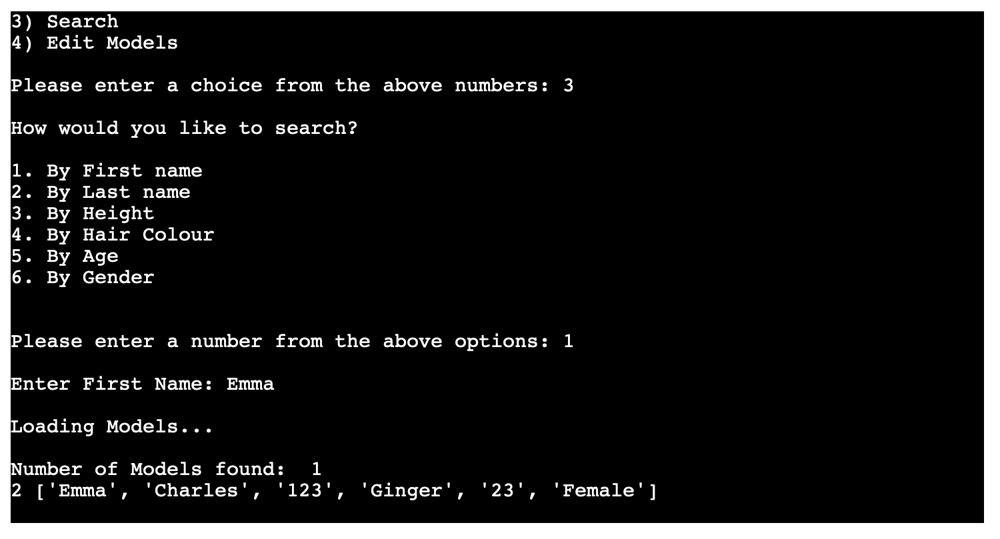

# Model Search

[Live application can be found here](https://model-search.herokuapp.com/)

This is a command-line interface application designed for a user to access models, retrieve models by a certain category, edit existing models & add new models. This project has been designed for educational purposes and uses the Code Institutes mock terminal to run.

---
## UX
To begin planning this project I started first with UX, designing the logic of the programme based upon the user stories. As this is a command-line application there is no design featured as HTML & CSS has not been used. 

### Strategy
User Stories:
- As a user, I want to be able to easily access all of my model's at once.
- As a user, I want to be able to retrieve a model's information based upon their first name, last name, height, hair colour, age or gender.
- As a user, I want to add new model information.
- As a user, I want to update an existing model's information if there has been a change.

### Structure

As you can see from the flowchart above the logic has been based around the four key user options, retrieving all model's, adding model's & editing existing model's, and searching for models by specific category. Each path will take the user back to the beginning once finished.

---
## Features
The features included in this programme are listed in the main menu and they can be seen below:

### Retrieve all models:
- From the main menu there is an option to Retrieve All Models, once the user has selected this all of the models will be printed to the terminal.

### Search Models:
- From the main menu there is an option to Search Models, once the user has selected this they are taken to another menu where they can choose what they would like to search by. 
    - First name
    - Last name
    - Height
    - Hair Colour 
    - Age 
    - Gender 
- Once the user has selected the field to search by & input the name/height/hair colour/age/gender, if there is a match this will be printed to the terminal.

### Add new models:
- From the main menu there is an option to Add New Model.
- Once the user has selected this option they are then asked to input a value for First Name, Last Name, Height, Hair Colour, Age, Gender. 
- Once all fields have been entered the user will be asked if they would like to save the model or not. 
- If they do the model will be saved, otherwise, they can go back to the main menu.

### Edit existing models:
- From the main menu there is an option to Edit Existing Models, once the user has selected this they will first be taken to search for the model by first name or last name.
- The user will then be asked for the name they would like to search. 
- If there's a match found, this will be printed to the terminal and the user will be asked to select which model they would like to edit. 
- The user will be asked which field they would like to edit and then be asked for the new information. 
- The new information will be saved to the spreadsheet. 

---
## Technologies Used

I have used several technologies that have enabled this design to work:

- [Python](https://www.python.org/)
    - Python is the core programming language used to write all of the code in this application to make it fully functional.
    - In addition to core Python I have used the following Python modules:
        - [Gspread](https://docs.gspread.org/en/latest/)
            - Used to access my google sheets document throughout the application, to access and edit data.
        - [Google Auth](https://google-auth.readthedocs.io/en/master/)
            - Used to provide access to the application to interact with my google sheet.
        - [pyinputplus](https://pyinputplus.readthedocs.io/en/latest/)
            - Used to validate all of the user inputs.
        - [PDB](https://www.geeksforgeeks.org/debugging-python-code-using-breakpoint-and-pdb/)
            - Used to debug my code when facing issues.
- [GitHub](https://github.com/)
    - Used to store code for the project after being pushed.
- [Git](https://git-scm.com/)
    - Used for version control by utilising the Gitpod terminal to commit to Git and Push to GitHub.
- [Gitpod](https://www.gitpod.io/)
    - Used as the development environment.
- [Heroku](https://dashboard.heroku.com/apps)
    - Used to deploy my application.
- [Lucid](https://lucid.app/documents#/dashboard)
    - Used to create the flowchart for the project.
- [Grammarly](https://www.grammarly.com/)
    - Used to fix the thousands of grammar errors across the project.
- [Google Sheets](https://www.google.co.uk/sheets/about/)
    - Used to store the 'Contacts' data used for the application.
- [Pep8](http://pep8online.com/)
    - Used to test my code for any issues or errors.

---
## Testing

### User Stories

*'As a user, I want to be able to easily access all of my models at once.'*  
This is one of the choices from the main menu, if the user selects option 1 all of the models are printed to the terminal.

*'As a user, I want to add new model information.'*  
This is one of the choices from the main menu, if the user selects option 2, they are taken to add a new contact. The user is asked to input a value for First Name, Last Name, Height, Hair Colour, Age, Gender. 

*'As a user, I want to be able to retrieve a models information based upon their first name, last name, height, hair colour, age or gender.'*  
This is one of the choices from the main menu, if the user selects option 3, they are taken to search their models by either name/height/hair colour/age/gender. If there is a match found it is printed to the terminal. 

*'As a user, I want to update an existing model's information if there has been a change.'*  
This is one of the choices from the main menu, if the user selects option 4, they are taken to search their contacts by either first name or last name. If there is a match found it is printed to the terminal and the user gets the option to edit a specific field. 

### Input Validation

As this programme relies heavily on users inputting information, validating these values is of the utmost importance at every step to ensure the information is viable.
I chose to use the `pyinputplus` module as this offers built-in validation. The main use of this is when the users are presented with a numbered menu, they then must input their choice, I used the following function:  
`def user_response(message, min_value, max_value):
    input = pyip.inputInt(prompt=message, min=min_value, max=max_value)
    return input`

I added the minimum and maximum value parameters to ensure that the user is only able to enter the numbers present in the menu, if they do not then the following error message is displayed:  

I also added a string or integer validation to ensure the user enters letters or numbers in the appropriate fields. If they do not the following error messages are displayed. 

### Bugs and Fixes

In addition to my own testing of the programme I passed my code through the [Pep8](http://pep8online.com/checkresult) online validator which passed through with 0 issues:

I didn't experience any bugs while creating this application, however in the future I would like to include a delete option and improve the readability and functionality of my code with better uses of classes. 

---
## Deployment

The master branch of this repository has been used for the deployed version of this application.

### Using Github & Gitpod

To deploy my command-line interface application, I had to use the [Code Institute Python Essentials Template](https://github.com/Code-Institute-Org/python-essentials-template), as this enables the application to be properly viewed on Heroku using a mock terminal.

- Click the `Use This Template` button.
- Add a repository name and brief description.
- Click the `Create Repository from Template` to create your repository.
- To create a Gitpod workspace you then need to click `Gitpod`, this can take a few minutes.
- When you want to work on the project it is best to open the workspace from Gitpod (rather than Github) as this will open your previous workspace rather than creating a new one. You should pin the workspace so that it isn't deleted.
-  Committing your work should be done often and should have clear/explanatory messages, use the following commands to make your commits:
    - `git add .`: adds all modified files to a staging area
    - `git commit -m "A message explaining your commit"`: commits all changes to a local repository.
    - `git push`: pushes all your committed changes to your Github repository.

*Forking the GitHub Repository*

If you want to make changes to your repository without affecting it, you can make a copy of it by 'Forking' it. This ensures your original repository remains unchanged.

1. Find the relevant GitHub repository
2. In the top right corner of the page, click the Fork button (under your account)
3. Your repository has now been 'Forked' and you have a copy to work on

*Cloning the GitHub Repository*

Cloning your repository will allow you to download a local version of the repository to be worked on. Cloning can also be a great way to backup your work.

1. Find the relevant GitHub repository
2. Press the arrow on the Code button
3. Copy the link that is shown in the drop-down
4. Now open Gitpod & select the directory location where you would like the clone created
5. In the terminal type 'git clone' & then paste the link you copied in GitHub
6. Press enter and your local clone will be created.

### Creating an Application with Heroku

I followed the below steps using the Code Institute tutorial:

- The following command in the Gitpod CLI will create the relevant files needed for Heroku to install your project dependencies `pip3 freeze --local > requirements.txt`. Please note this file should be added to a .gitignore file to prevent the file from being committed.

1. Go to [Heroku.com](https://dashboard.heroku.com/apps) and log in; if you do not already have an account then you will need to create one.
2. Click the `New` dropdown and select `Create New App`.
3. Enter a name for your new project, all Heroku apps need to have a unique name, you will be prompted if you need to change it.
4. Select the region you are working in.

*Heroku Settings*
You will need to set your Environment Variables - this is a key step to ensuring your application is deployed properly.
- In the Settings tab, click on `Reveal Config Vars` and set the following variables:
    - If using credentials you will need to add the credentials as a variable, the key is the name 'CREDS' and the value is the contents of your creds JSON
    - Add key: `PORT` & value `8000`
- Buildpacks are also required for proper deployment, simply click `Add buildpack` and search for the ones that you require.
    - For this project, I needed to add `Python` and `Node.js`, in this order.

*Heroku Deployment*
In the Deploy tab:
1. Connect your Heroku account to your Github Repository following these steps:
    1. Click on the `Deploy` tab and choose `Github-Connect to Github`.
    2. Enter the GitHub repository name and click on `Search`.
    3. Choose the correct repository for your application and click on `Connect`.
2. You can then choose to deploy the project manually or automatically, automatic deployment will generate a new application every time you push a change to Github, whereas manual deployment requires you to push the `Deploy Branch` button whenever you want a change made.
3. Once you have chosen your deployment method and have clicked `Deploy Branch` your application will be built and you should see the below `View` button, click this to open your application:

---
## Credits

I used the following forum to help me design my main menu (https://python-forum.io/thread-22341.html). 

I sourced my another_task function from Daisy Gunn's Contact Book (https://github.com/daisygunn/my-contact-book) and also used this as a guideline when creating my validation functions using pyinputplus, retrieve all model's function and add new model function. 

Along with this I also used (https://automatetheboringstuff.com/2e/chapter8/) to help me with my validation using pyinputplus. 

All other code has been written by me. 

---
## Acknowledgements

I would like to thank my course mentor Sandeep Aggarwal for his support and guidance throughout the course of the project and my peer Daisy Gunn for their support & feedback.

---
